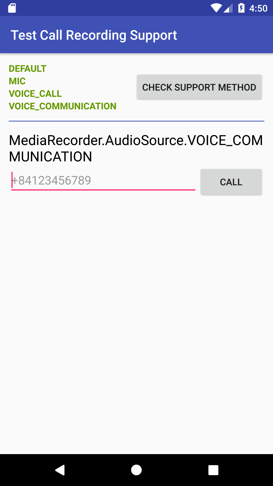

# call-recording-master
This is an demo to help you to check which type of MediaRecorder.AudioSource that your phone support. Normally it's contains 4 types: DEFAULT, MIC, VOICE_CALL, VOICE_COMMUNICATION, base on android version of your phone that will support or unsupport some of them.

So to make your app work prefectly with all android versions we should change the AudioSource type following the android version with this rule:
```
if (android.os.Build.VERSION.SDK_INT < Build.VERSION_CODES.M) {
    recorder.setAudioSource(MediaRecorder.AudioSource.VOICE_CALL);
    callType = "VOICE_CALL";
} else if (android.os.Build.VERSION.SDK_INT < Build.VERSION_CODES.N) {
    recorder.setAudioSource(MediaRecorder.AudioSource.MIC);
    callType = "MIC";
} else {
    recorder.setAudioSource(MediaRecorder.AudioSource.VOICE_COMMUNICATION);
    callType = "VOICE_COMMUNICATION";
}
```

Screenshot:  

Checkout demo for detail.
